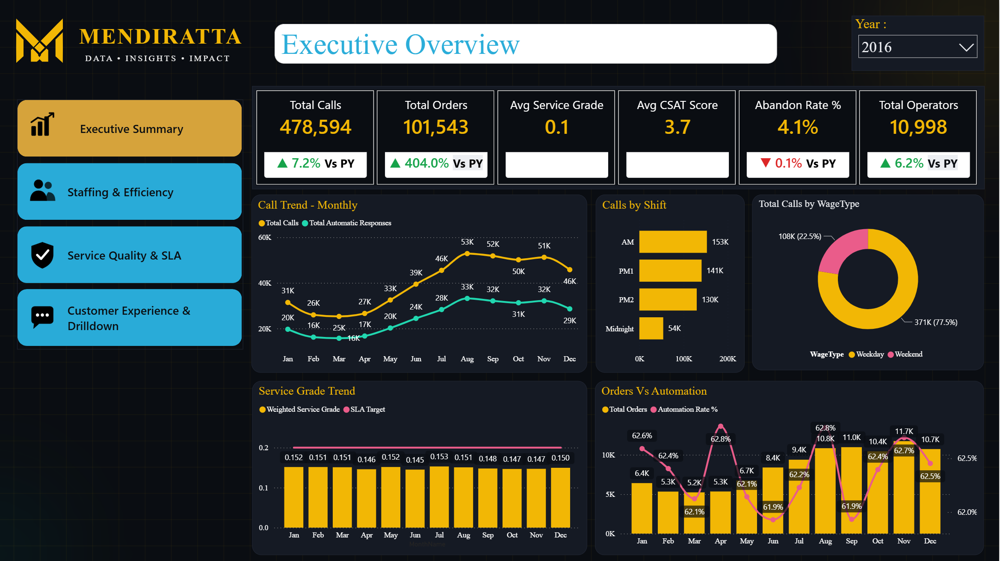
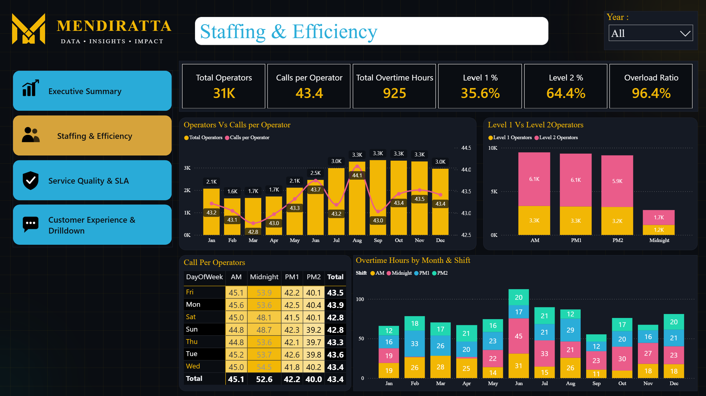
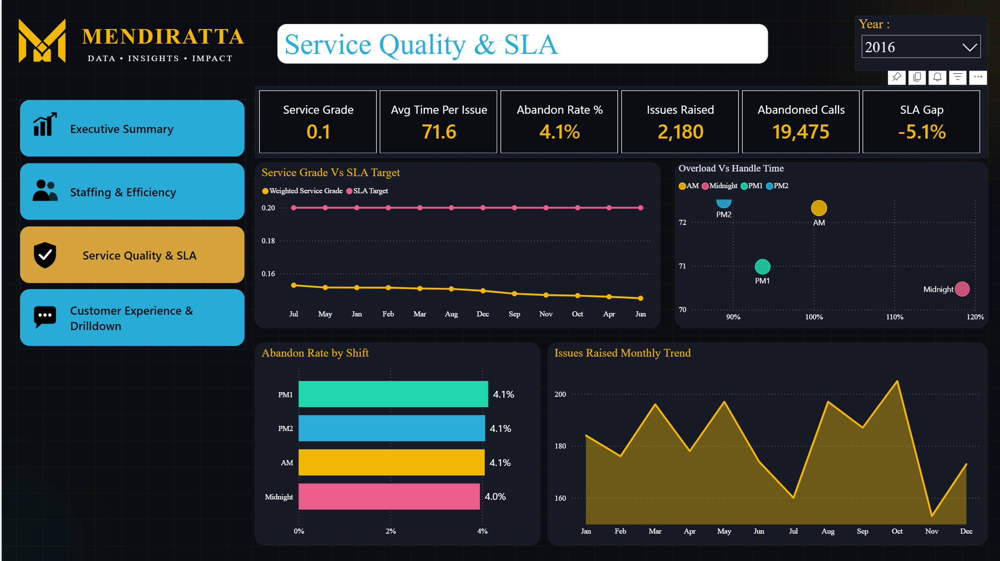
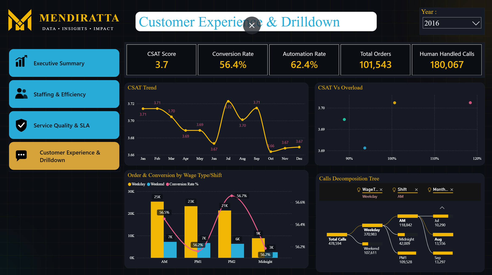

# Call Center Analytics

## Overview
A multi-page operational dashboard built for call center leadership to monitor volume, staffing efficiency, service quality, and customer experience in one connected view — with dedicated drill-down pages behind each KPI area rather than a single flat report.

## What it Does : 
1. Tracks Total Calls, Total Orders, Service Grade, CSAT, Abandon Rate, and Operator headcount side-by-side, each benchmarked against prior-year performance so leadership sees momentum, not just a snapshot.
2. Breaks call volume down by shift (AM/PM1/PM2/Midnight) and by WageType (Weekday vs. Weekend), surfacing where staffing pressure actually concentrates rather than leaving it buried in a raw call log.
3. Overlays Service Grade against SLA Target month-by-month, turning a compliance requirement into a visual trend the ops team can act on before a miss happens, not after.
4. Tracks automation rate alongside order volume, showing whether growth is being absorbed by self-service systems or by live agents — a direct signal for capacity planning.
5. Left-hand navigation (Executive Summary, Staffing & Efficiency, Service Quality & SLA, Customer Experience & Drilldown) structures the report the way a call center director actually thinks about the business — not as one crowded page, but as a guided path through it.

## Why this Matters for your Business
Call center leaders are usually stitching this picture together from separate ACD reports, WFM exports, and a CSAT spreadsheet. This dashboard puts volume, staffing, SLA compliance, and customer sentiment on one page that updates automatically — so the conversation in a leadership meeting shifts from "let me pull that number" to actually deciding what to do about it.

## Pages
1. **Executive Overview** — Top-line Volume, Cost, and SLA Trends
2. **Staffing & Efficiency** — Shift-level Overload Ratios, Agent Utilization
3. **Service Quality & SLA** — SLA Adherence, Abandonment Rate, Average Handle Time
4. **Customer Experience** — CSAT Trends, First-call Resolution

## Key DAX Techniques
- Weighted average measures (e.g., weighted AHT across call types, not a simple average)
- Shift-specific Overload Ratio baselines using `SWITCH()` to apply different thresholds per shift
- `ALLSELECTED()` fix for rank measures so rankings stay correct even when slicers are applied

## Design Notes
Custom SVG navigation icons (converted to PNG) matching a reference button style, maintaining visual consistency across all four pages.

## Tech Stack
Power BI Desktop, DAX, Power Query (M)