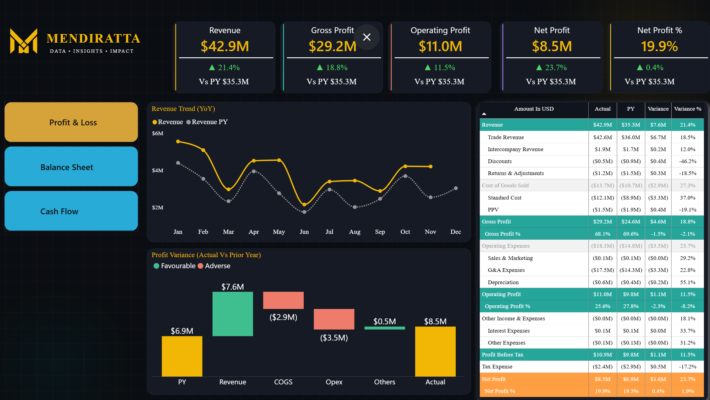
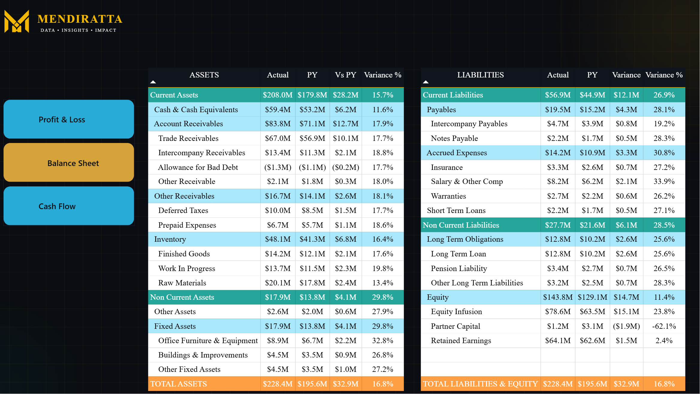
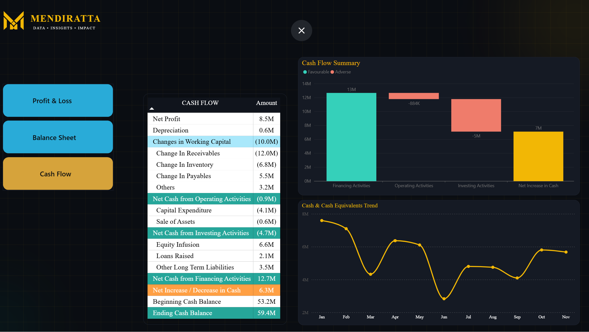

# Three-Statement Financial Model

## Overview
A full three-statement financial reporting dashboard built for finance teams who need management-level P&L, Balance Sheet, and Cash Flow visibility without waiting on a manual close-cycle report.

## What it Does : 
1. Surfaces Revenue, Gross Profit, Operating Profit, Net Profit, and Net Profit % as headline KPIs, each benchmarked against prior year so performance trend is visible immediately, not buried in a static export.
2. Presents a full P&L account hierarchy — Trade Revenue, Intercompany Revenue, Discounts, Standard Cost, Purchase Price Variance (PPV), Operating Expenses by category, down to Profit Before Tax and Net Profit — with Actual, Prior Year, Variance, and Variance % side-by-side for every line.
3. A Profit Variance waterfall bridges Prior Year Net Profit to Current Year Net Profit through Revenue, COGS, Opex, and Other impacts — turning "why did margin move" into a single visual instead of a multi-tab investigation.
4. Revenue Trend (YoY) tracks monthly performance against the prior year on the same chart, isolating genuine growth from seasonal noise.
5. Balance Sheet and Cash Flow pages extend the same reporting discipline across all three core financial statements, not just the income statement.

## Why this Matters for your Business
Most finance teams rebuild this exact view in Excel every single month — pulling actuals, comparing to prior year, chasing down variance explanations by hand. This dashboard automates that entire cycle: connect it to your data source once, and Revenue, margin, and variance analysis refresh instantly, with drill-down into the exact account line driving any movement.

## Pages
1. **Profit & Loss** — Revenue, cost, and margin trends by period, with variance against Prior Year
2. **Balance Sheet** — Assets, liabilities, and equity position at a glance, with trend view across periods
3. **Cash Flow**    — Operating, Investing, and Financing Cash Movements, plus a rolling cash position view

## Design Notes
Custom SVG navigation icons (converted to PNG) matching a reference button style, maintaining visual consistency across all four pages.

## Tech Stack
Power BI Desktop, DAX, Power Query (M)