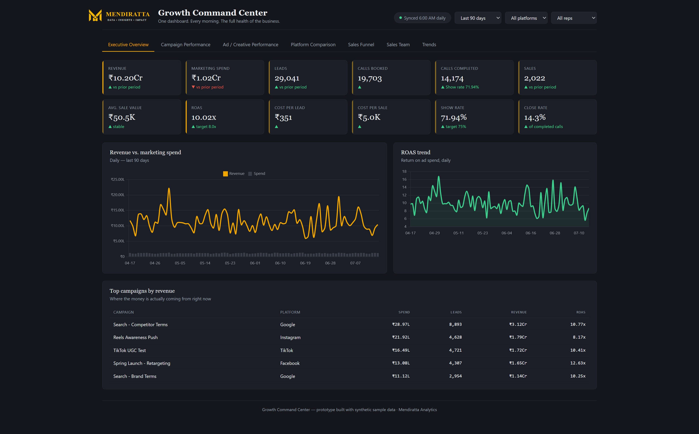
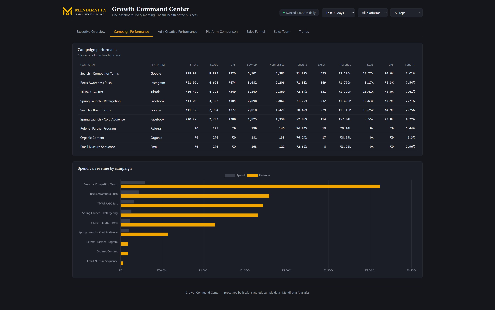
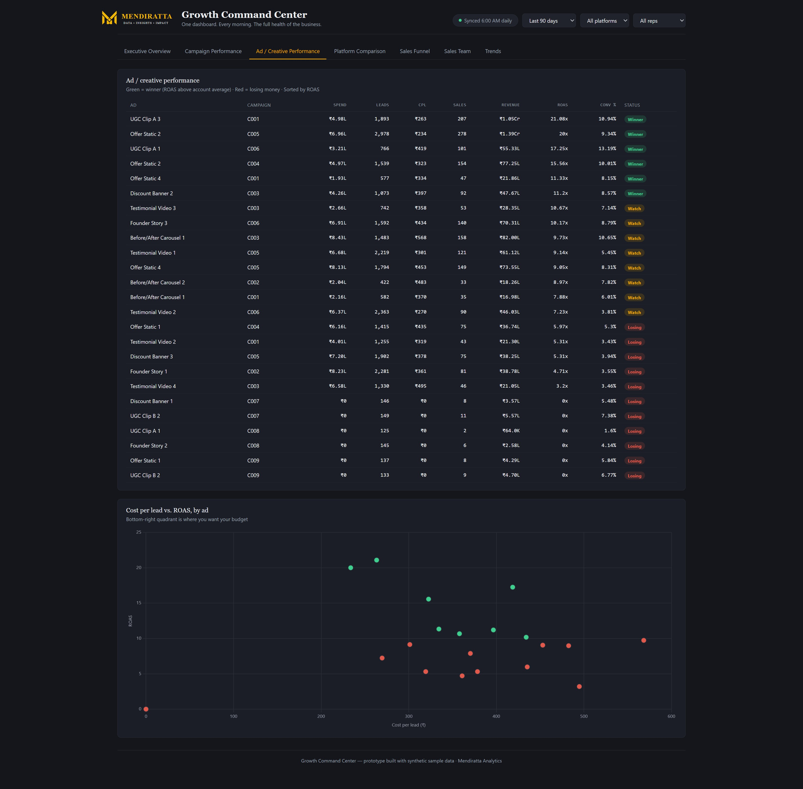
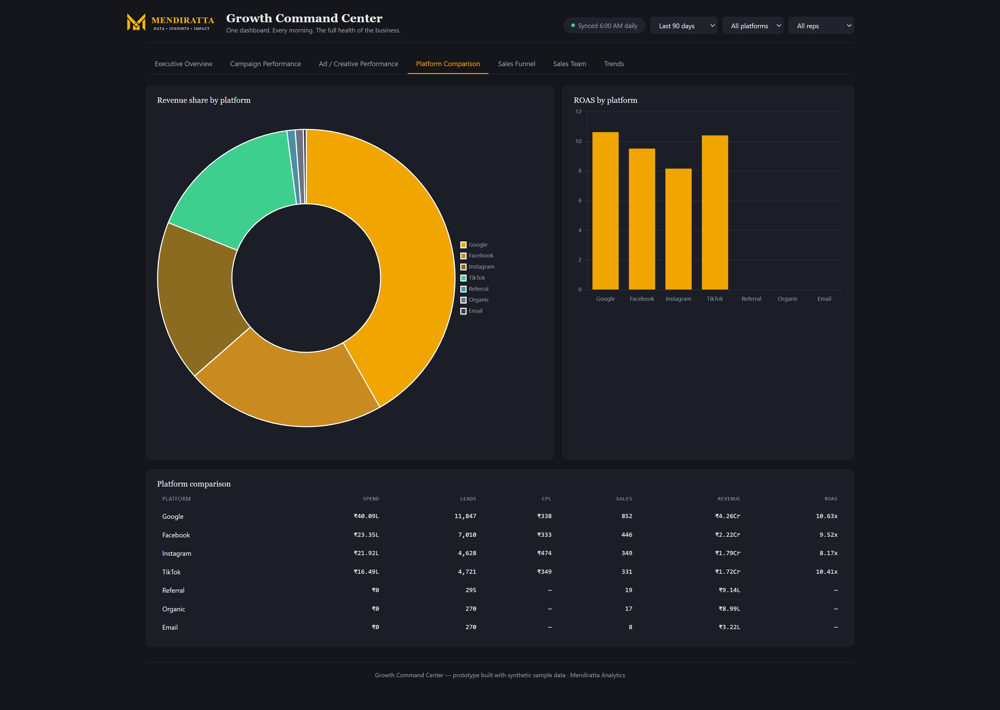
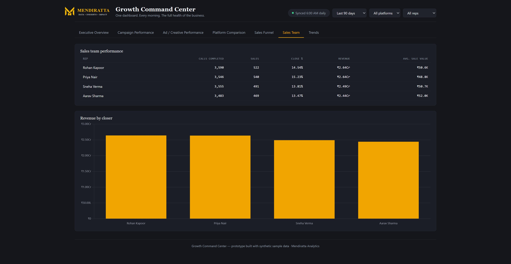
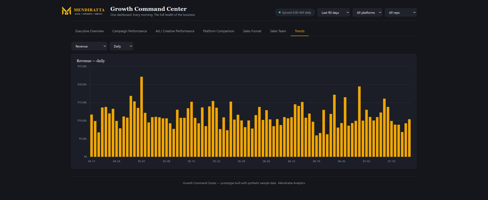

# Growth Command Center

**A morning-open KPI dashboard for marketing & sales — built with Python, Flask, and pandas.**

One dashboard. Every morning. The full health of the business — revenue, marketing spend, leads, calls, sales, and ROAS, sliced by date range, platform, and sales rep.


---

## What this is

A KPI dashboard for businesses running paid marketing (Meta, Google, TikTok, etc.) with a sales team following up on leads. It answers, in under five minutes:

- Is revenue up or down vs. the prior period, and why?
- Which campaigns and ads are actually profitable — and which are burning budget?
- Where is the funnel leaking — lead → call booked → call completed → sale?
- Which sales rep is converting best?

Built to be **scalable by design** — a proper star-schema data model underneath, so adding a new marketing platform or a new sales rep is a data change, not a rebuild.

---

## Screenshots

> 
> 
> 
> 
> 
> 
> 
> ```

---

## Tech stack

| Layer | Tool | Why |
|---|---|---|
| Data model | **pandas** | star-schema joins + aggregation, the same relationships you'd build in Power BI |
| Backend | **Flask** | serves the dashboard page + a small `/api/data` endpoint that recomputes KPIs per filter selection |
| Frontend | **HTML / CSS / vanilla JS + Chart.js** | no frontend framework — kept deliberately simple and fast |
| Data source (current) | **Synthetic CSVs** (`/data`) | star schema: `dim_date`, `dim_campaign`, `dim_ad`, `dim_salesrep` + `fact_leads`, `fact_ad_spend` |
| Data source (planned) | **Meta Ads API + Pipedrive API** | 

---


## Dashboard sections

| Tab | What it shows |
|---|---|
| **Executive Overview** | 12 KPI cards, revenue-vs-spend trend, ROAS trend, top campaigns |
| **Campaign Performance** | Full sortable table + spend-vs-revenue chart, per campaign |
| **Ad / Creative Performance** | Winner/Watch/Losing tags by ROAS, CPL-vs-ROAS scatter plot |
| **Platform Comparison** | Revenue share + ROAS, across Facebook/Instagram/Google/TikTok/Organic/Referral/Email |
| **Sales Funnel** | Lead → call booked → call completed → sale, with stage conversion % |
| **Sales Team** | Revenue, close rate, and average sale value by rep |
| **Trends** | Daily / weekly / monthly view of any core metric |

---
## License

MIT
---

## Author

Built by **Vikram Mendiratta** — FP&A and BI consultant, Power BI / Python / SQL.
📧 Open an issue or reach out via [Upwork](#) / [LinkedIn](#) for consulting inquiries.