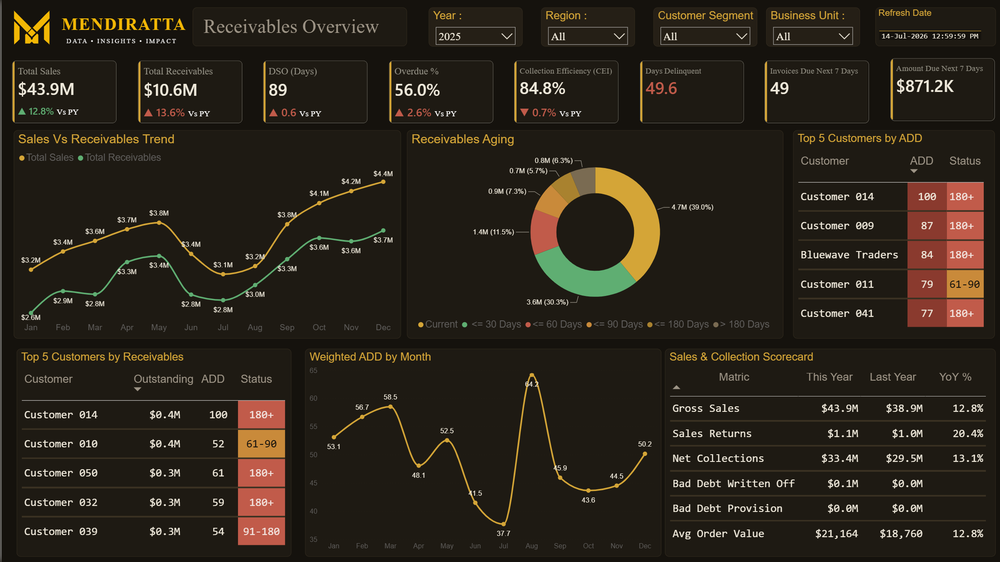

# Sales & Receivables Analytics Dashboard

## Overview
A collections-focused executive dashboard built to give finance leaders same-day visibility into cash tied up in accounts receivable, without waiting on a manual aging report.
## What it Does : 
1. Tracks Total Receivables, DSO, Overdue %, and Collection Efficiency (CEI) side-by-side with Total Sales, so leadership can see revenue growth and collections health in the same glance — growth that isn't being converted to cash is a warning sign, and this surfaces it immediately.
2. Breaks receivables into aging buckets (Current through 180+ days) with a live donut visualization, so the collections team knows exactly where risk is concentrated.
3. Surfaces the Top 5 highest-risk customers by both outstanding balance and average days delinquent, turning a static report into an actionable call list.
4. A forward-looking "Amount Due Next 7 Days" panel gives treasury a short-term cash inflow forecast — not just a historical rearview.
5. Fully dynamic: Year, Region, Customer Segment, and Business Unit slicers recalculate every visual instantly — no separate reports needed per filter combination.

## Why this Matters for your Business
DSO and aging reports are usually static exports that go stale the moment they're generated. This dashboard stays live — filter to any region, segment, or time period and every number, chart, and risk list recalculates in seconds, so finance teams spend time acting on collections risk instead of rebuilding spreadsheets to find it.

## Key DAX Techniques
- Dynamic point-in-time balance calculation using `MAX(DimDate[Date])` as a rolling anchor
- Measure-switching dispatcher pattern via a disconnected metrics table (lets users toggle between DSO/CEI/Aging from one slicer)
- DSO and CEI formulas with rolling aging buckets (0-30, 31-60, 61-90, 90-180, 180+ Days)

## Design Notes
Custom SVG navigation icons (converted to PNG) matching a reference button style, maintaining visual consistency across all four pages.

## Tech Stack
Power BI Desktop, DAX, Power Query (M)