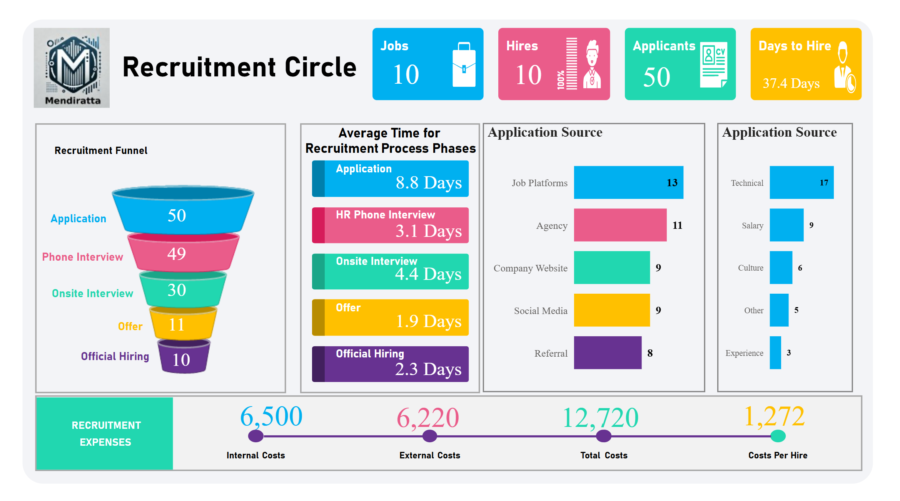

# Recruitment Funnel & Hiring Analytics

## Overview
An HR analytics dashboard tracking the full recruitment funnel — from application through official hire — giving talent teams a clear view of where candidates drop off and what hiring actually costs.

## What it Does : 
1. Full funnel visualization (Application → Phone Interview → Onsite → Offer → Hire) with conversion percentage at each stage, immediately showing where the biggest candidate loss happens.
2. Average time-in-stage for every phase of the process, surfacing bottlenecks — useful for setting realistic time-to-hire expectations.
3. Application source breakdown shows which channels (Job Platforms, Agency, Referral, etc.) actually produce candidates, informing where to invest recruiting spend.
4. Decline reason tracking (Technical, Culture, Salary, Experience) turns rejected offers into a diagnostic tool instead of a dead end
5. Full cost breakdown down to Cost Per Hire, connecting recruiting activity directly to budget impact

## Why this Matters for your Business
Hiring managers often know that a role took too long to fill, but not where in the process it slowed down or why candidates said no. This dashboard answers both — turning recruiting from a gut-feel process into something measurable and improvable.

## Design Notes
Custom SVG navigation icons (converted to PNG) matching a reference button style, maintaining visual consistency across all four pages.

## Tech Stack
Power BI Desktop, DAX, Power Query (M)