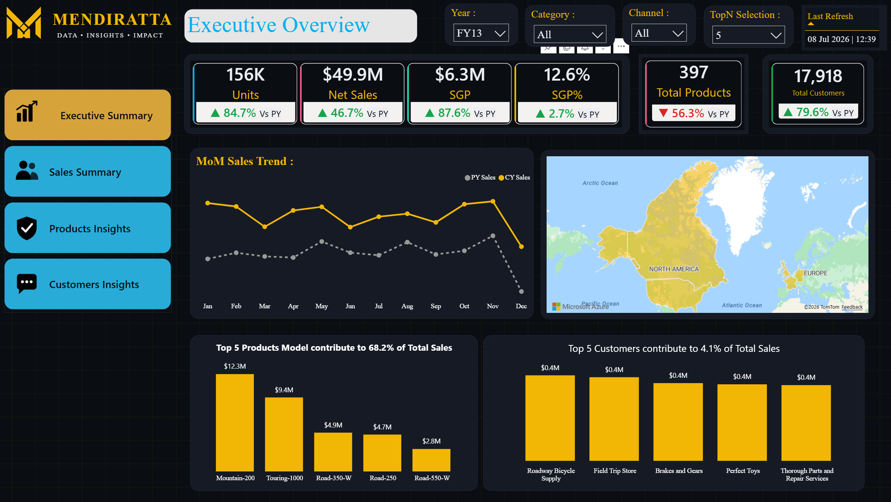
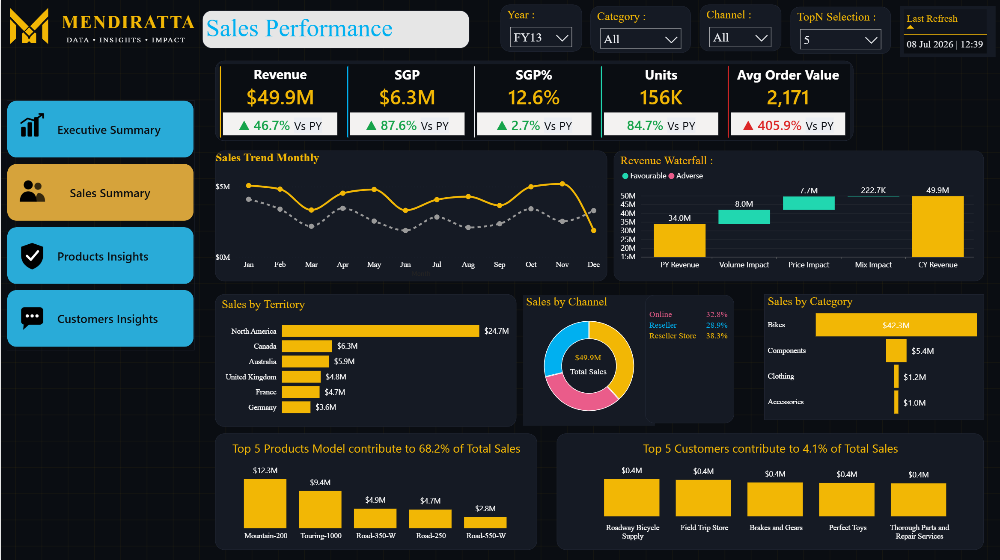
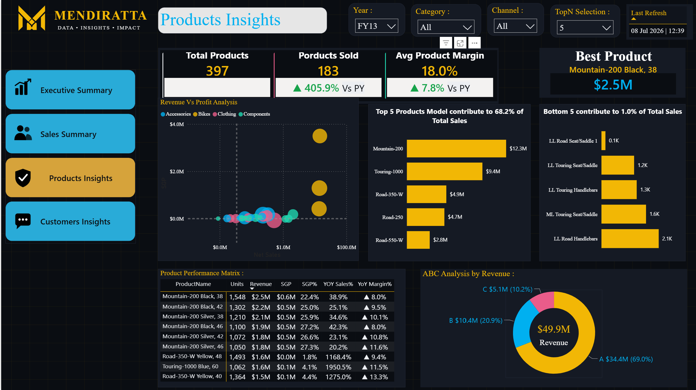
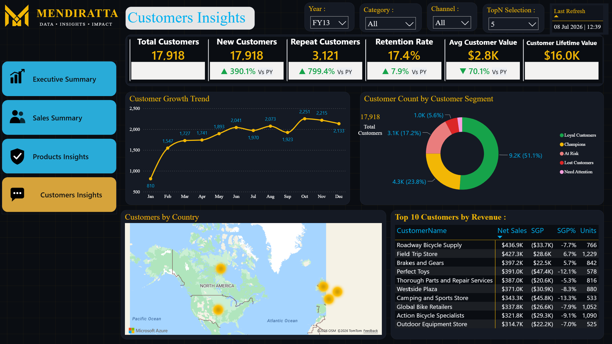

# Sales Performance Analysis

## Overview
An executive-level sales analytics dashboard built to give leadership a real-time read on revenue performance across regions, products, and sales channels — replacing static monthly sales decks with a live, filterable report.

## What it Does : 
1. Surfaces headline KPIs (Total Sales, YoY Growth, Average Order Value, Invoice Volume) so performance is legible in seconds, not buried in a spreadsheet
2. Breaks sales down by region, product category, and channel, so leadership can see exactly where growth is coming from — and where it's stalling
3. Tracks sales trend over time with year-over-year comparison, distinguishing genuine growth from seasonal noise.
4. Ranks top-performing sales reps or products, turning a static report into an actionable list rather than a wall of numbers.
5. Fully interactive: slicers for year, region, and category recalculate every visual instantly, so one report replaces what used to be several static exports.

## Why this Matters for your Business
Sales leaders shouldn't have to wait for a monthly deck to know how the quarter is trending. This dashboard stays live — filter to any region, product line, or time period and every number recalculates instantly, so conversations shift from "let me pull that" to actually deciding what to do about the numbers in front of you.

## Pages
1. **Executive Overview** — KPI Cards (Sales, SGP, SGP% & Units), Sales trend, Top 5 Products, Top 5 Customers
2. **Sales Summary** — Revenue Waterfall, Sales by Channel, Category & Territory
3. **Products Insights** — Revenue & Profit Chart, KPI Cards (Product Sold, Average Product Margin), Best Selling Products, Top & Bottom 5 Products and thier contribution.
4. **Customers Insights** — Customer Growth Trend, Top Customers, Customer Contribution.

## Design Notes
Custom SVG navigation icons (converted to PNG) matching a reference button style, maintaining visual consistency across all four pages.

## Tech Stack
Power BI Desktop, DAX, Power Query (M)