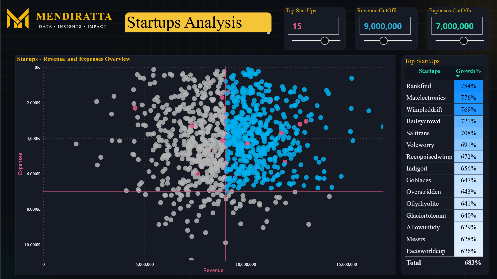

# Global Startup Funding & Unicorn Analytics

## Overview
An interactive analytics dashboard tracking global startup funding activity, unicorn company distribution, and sector-level investment trends — built for investors, analysts, or founders who need a fast read on where capital is actually flowing.

## What it Does : 
1. Summarizes total funding raised, number of startups tracked, and unicorn count in top-line KPI cards, giving an instant scale check before drilling into detail.
2. Maps funding activity geographically, making regional concentration and whitespace opportunities visible at a glance instead of buried in spreadsheets.
3. Breaks investment down by industry and sector, highlighting where capital is concentrating and helping identify emerging versus saturated markets.
4. Tracks funding trends over time to reveal whether the broader investment environment is expanding or cooling.
5. Ranks the highest-funded companies and unicorns in a detailed table for quick exploration and comparison.

## Why this Matters for your Business
Startup and venture capital data is often scattered across Crunchbase exports, news articles, and manually maintained spreadsheets. This dashboard consolidates funding activity, geographic distribution, and sector trends into a single interactive experience. Users can filter by region, industry, or year and every visual updates instantly, transforming hours of manual research into minutes of interactive analysis.

## Design Notes
Custom SVG navigation icons (converted to PNG) matching a reference button style, maintaining visual consistency across all four pages.

## Tech Stack
Power BI Desktop, DAX, Power Query (M)